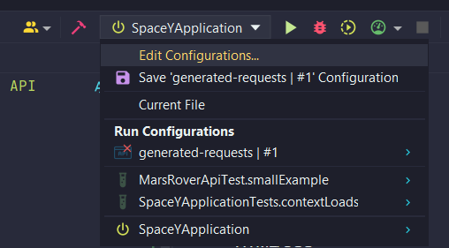
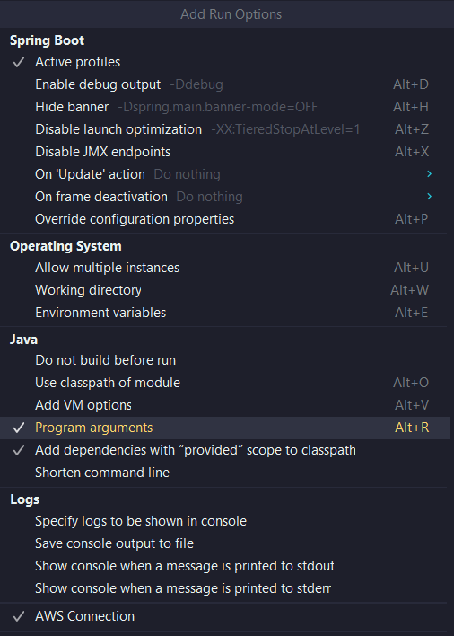

# Space-Y. Restful API and client implementation of NASA Mars Rover API
### Used technologies
* Java 19
* Spring Boot
* Spring Security
* Spring Data JPA
* Maven
* XML, JSON
* PostgreSQL
* HTML/CSS
* JavaScript
* REST API
* NASA Mars Rover API
* IntelliJ IDEA
### Features
* Authentication, authorization
* Observe Mars photos in real time
* Keep track of users
* Internationalization
### Project configuration
* Run SQL scripts in directory ```src/main/resources/static/sql```
  * First ``ddl-db.sql``
  * Then ``dml-db.sql``
* Connect created db with project:
  * Get NASA API using this link: https://api.nasa.gov
  * Click on 'Edit configuration'
  
  

  * In 'Build and run' section click on 'Modify options'
  * Select 'Program arguments' option
  
  

  * Then add following variables with your values
  where `--API_KEY=` is your NASA API KEY
  `--DB_URL=` - url to database
  `--DB_USERNAME= ` and `--DB_PASSWORD=` username and password to database
  
  

* Run project and got to this address ``http://localhost:8080/auth/login``
